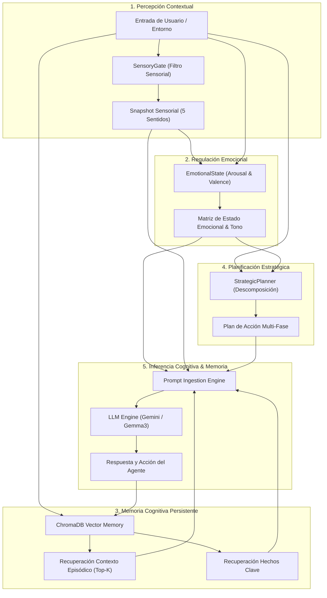
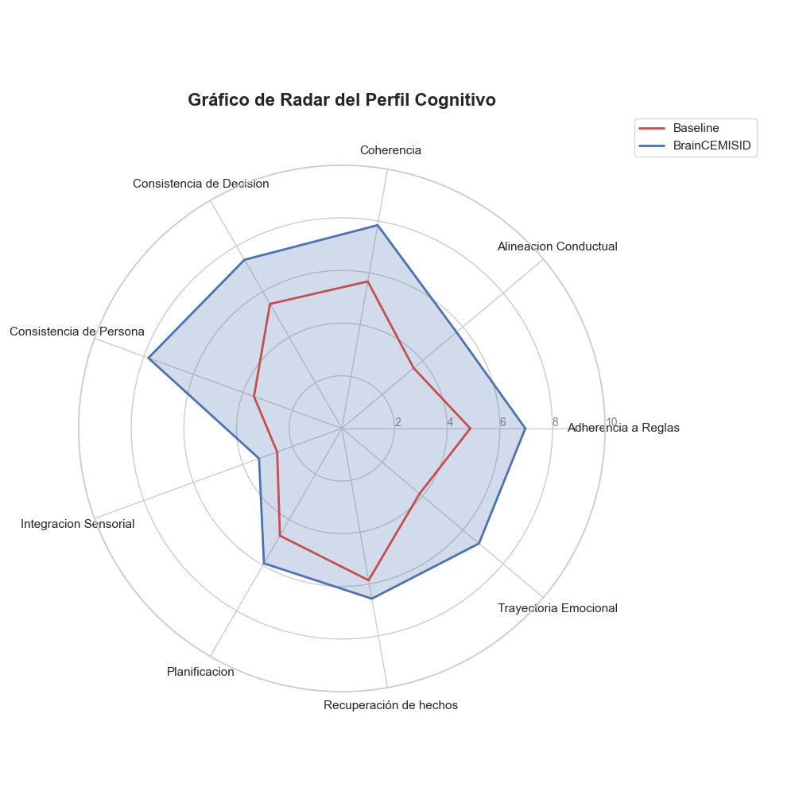
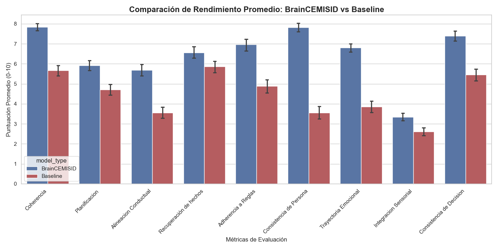

# BrainCEMISID: Arquitectura Cognitiva Sintética utilizando IA Generativa

[](https://opensource.org/licenses/MIT)
[](https://www.python.org/downloads/)
[](https://deepmind.google/technologies/gemini/)
[](https://www.trychroma.com/)
[](https://oaaees.github.io/BrainCEMISID/)

> **Proyecto de Grado - Ingeniería de Sistemas**  
> *BrainCEMISID: Una Arquitectura Cognitiva Sintética utilizando IA generativa*  
> 📄 **Documento Completo de Tesis (PDF):** [`BrainCEMISID_ Una Arquitectura Cognitiva Sintética utilizando IA generativa.pdf`](./BrainCEMISID_%20Una%20Arquitectura%20Cognitiva%20Sint%C3%A9tica%20utilizando%20IA%20generativa.pdf)  
> 🌐 **Sitio Web Interactivo:** [Ver Presentación Web / Live Showcase](https://oaaees.github.io/BrainCEMISID/)

---

## 📌 Resumen del Proyecto / Abstract

Las aplicaciones convencionales basadas en Modelos de Lenguaje de Gran Escala (LLM) suelen operar bajo un esquema reactivo de entrada-salida sin estado implícito o con memoria conversacional lineal simple. A medida que el horizonte contextual se extiende en tareas complejas y simulaciones multi-agente, los LLMs sufren de degradación de persona, pérdida de atención episódica y falta de consistencia conductual y emocional.

**BrainCEMISID** es una **Arquitectura Cognitiva Sintética (ACS)** inspirada en el marco teórico **COALA** (*Cognitive Architectures for Language Agents*). La arquitectura integra:
1. **Memoria Episódica y Declarativa Operativa**: Indexación vectorial persistente mediante **ChromaDB** y recuperación de contextos históricos.
2. **Dinámica Emocional (Arousal & Valence)**: Seguimiento continuo del estado afectivo interno del agente y su impacto en el tono y decisiones.
3. **Filtro Cognitivo Sensorial (`SensoryGate`)**: Extracción y filtrado de señales contextuales del entorno en 5 dimensiones sensoriales.
4. **Planificación Estratégica Procedimental (`StrategicPlanner`)**: Descomposición jerárquica de objetivos en sub-pasos estructurados.
5. **Ejecución Cognitiva Single-Pass (`LLMEngine`)**: Orquestación unificada que inyecta estado emocional, estímulos sensoriales, hechos recuperados y plan en un único pase de inferencia LLM.

La arquitectura fue evaluada mediante un pipeline automatizado de **1,664 muestras experimentales** distribuidas en **8 escenarios complejos**, utilizando un marco de **LLM-as-a-Judge de 9 métricas cognitivas**, pruebas de hipótesis t-Student de Welch y tamaño del efecto de Cohen ($d$).

---

## 🧠 Arquitectura del Sistema / Architecture Overview

El flujo de procesamiento cognitivo de BrainCEMISID opera en un bucle continuo de percepción-emoción-memoria-planificación-acción:



### Módulos Principales

* **`core/sensors.py` (`SensoryGate`)**: Analiza la entrada del entorno y extrae estímulos visuales, auditivos, táctiles, olfativos y gustativos relevantes.
* **`core/emotions.py` (`EmotionalState`)**: Mantiene un vector continuo de estado de ánimo (Alegría, Ansiedad, Frustración, Calma, etc.), modulando las respuestas ante eventos positivos o estresantes.
* **`core/memory.py` (`Memory`)**: Gestiona la memoria de trabajo y la memoria a largo plazo a través de ChromaDB, generando embeddings vectoriales para recordar hechos clave y episodios pasados.
* **`core/planner.py` (`StrategicPlanner`)**: Descompone metas complejas en secuencias ordenadas de pasos razonados antes de ejecutar acciones.
* **`core/llm_engine.py` (`LLMEngine`)**: Capa de abstracción compatible con Gemini API y modelos locales en Ollama (`gemma3:1b`).

---

## 📊 Resultados Empíricos / Experimental Results

La evaluación experimental comparó **BrainCEMISID** frente a un **LLM Baseline** (prompts secuenciales estándar sin orquestación cognitiva) y dos variantes con ablación (**Brain_No_Memory** y **Brain_No_Emotion**).

### Comparativa Principal: BrainCEMISID vs. Baseline LLM ($N = 1,664$ muestras)

| Métrica Cognitiva | BrainCEMISID (Media) | Baseline LLM (Media) | p-valor ($p < 0.05$) | d de Cohen (Efecto) |
| :--- | :---: | :---: | :---: | :---: |
| **Coherencia / Coherence** | **7.84** | 5.67 | $< 0.0001$ * | $0.91$ (Grande) |
| **Efectividad de Planificación / Planning** | **5.92** | 4.70 | $< 0.0001$ * | $0.46$ (Mediano) |
| **Alineación Conductual / Behavioral Alignment** | **5.69** | 3.56 | $< 0.0001$ * | $0.72$ (Mediano) |
| **Recuperación de Hechos / Fact Recall** | **6.57** | 5.86 | $< 0.0010$ * | $0.24$ (Pequeño) |
| **Adherencia a Reglas / Rule Adherence** | **6.97** | 4.88 | $< 0.0001$ * | $0.62$ (Mediano) |
| **Consistencia de Persona / Persona Consistency** | **7.82** | 3.55 | $< 0.0001$ * | **$1.55$ (Masivo)** |
| **Trayectoria Emocional / Emotional Trajectory** | **6.80** | 3.86 | $< 0.0001$ * | **$1.15$ (Masivo)** |
| **Integración Sensorial / Sensory Integration** | **3.35** | 2.61 | $< 0.0001$ * | $0.37$ (Pequeño/Med) |
| **Consistencia de Decisiones / Decision Consistency** | **7.40** | 5.46 | $< 0.0001$ * | $0.66$ (Mediano) |

*\* Todas las diferencias son estadísticamente significativas con $p < 0.05$.*

### 📈 Gráficos Destacados

#### 1. Perfil Radar Cognitivo (BrainCEMISID vs. Baseline)


#### 2. Comparativa de Rendimiento Promedio por Métrica


---

## 🔍 Estudios de Ablación / Ablation Findings

1. **Impacto del Módulo de Memoria (`Brain_No_Memory`)**:
   - Eliminar la memoria vectorial provocó caídas críticas en **Coherencia** ($p < 0.0001, d = 0.54$) y **Consistencia de Decisiones** ($p < 0.0001, d = 0.39$).
   - La arquitectura completa retuvo en promedio un **20.0% más de hechos específicos contextuales** en escenarios extensos.

2. **Impacto del Módulo Emocional (`Brain_No_Emotion`)**:
   - Sin regulación emocional explícita, la **Trayectoria Emocional** cayó de $6.80$ a $5.30$ ($p < 0.0001$) y la **Consistencia de Persona** descendió de $7.82$ a $6.39$ ($p < 0.0001$).
   - Esto valida que la retroalimentación afectiva es indispensable para sostener personalidades estables a lo largo del tiempo.

---

## 💻 Instalación y Uso / Quick Start

### Requisitos Previos
* Python 3.10 o superior
* Ollama (para ejecución local con `gemma3:1b`) o Clave de API de Gemini (`GEMINI_API_KEY`)

### 1. Clonar el Repositorio e Instalar Dependencias
```powershell
git clone https://github.com/oaaees/BrainCEMISID.git
cd BrainCEMISID

# Crear y activar entorno virtual
python -m venv .venv
.\.venv\Scripts\activate

# Instalar requerimientos
pip install -r requirements.txt
```

### 2. Configurar Variables de Entorno (Opcional para Gemini)
Crea un archivo `.env` en la raíz del proyecto:
```env
GEMINI_API_KEY=tu_api_key_aqui
```

### 3. Ejecutar la Simulación Interactiva
```powershell
python main.py
```

### 4. Ejecutar el Pipeline de Simulación Masiva
```powershell
python simulation/runner.py
```

### 5. Ejecutar el Motor de Análisis Estadístico
```powershell
python analysis/stats_engine.py
```

---

## 📁 Estructura del Proyecto / Project Structure

```
BrainCEMISID/
├── analysis/                     # Pipeline de evaluación y estadísticas
│   ├── evaluator.py              # Framework LLM-as-a-Judge (9 métricas)
│   ├── stats_engine.py           # Motor de análisis t-Student de Welch & Cohen's d
│   ├── metrics_summary.csv       # Dataset procesado (1,664 muestras)
│   ├── plots/                    # Gráficos generados (Inglés)
│   └── plots_es/                 # Gráficos generados (Español)
├── core/                         # Módulos centrales de la arquitectura cognitiva
│   ├── emotions.py               # Rastreo de valencia y arousal emocional
│   ├── llm_engine.py             # Abstracción de inferencia LLM (Gemini/Ollama)
│   ├── memory.py                 # Memoria conversacional y vectorial (ChromaDB)
│   ├── orchestrator.py           # Motor de orquestación de simulación
│   ├── planner.py                # Descomposición estratégica de tareas
│   └── sensors.py                # Filtro de extracción sensorial
├── docs/                         # Presentación Web e Interactiva (GitHub Pages)
│   └── index.html                # Showcase Web con gráficos interactivos
├── simulation/                   # Definición de escenarios de simulación
│   ├── runner.py                 # Ejecutor multi-escenario
│   ├── airspace_controller.json  # Escenario: Controlador de Tráfico Aéreo
│   ├── disaster_response.json    # Escenario: Respuesta ante Desastres
│   └── ...                       # Otros 6 escenarios estructurados
├── main.py                       # CLI interactivo de la arquitectura
├── requirements.txt              # Librerías y dependencias Python
└── README.md                     # Documentación principal del repositorio
```

---

## 📜 Citas y Créditos / Citation & Credits

Este trabajo forma parte del **Trabajo Especial de Grado en Ingeniería de Sistemas**:
* **Título**: *BrainCEMISID: Una Arquitectura Cognitiva Sintética utilizando IA generativa*
* **Documento Adjunto**: [Descargar Tesis en PDF](./BrainCEMISID_%20Una%20Arquitectura%20Cognitiva%20Sint%C3%A9tica%20utilizando%20IA%20generativa.pdf)
* **Demostración Web**: [https://oaaees.github.io/BrainCEMISID/](https://oaaees.github.io/BrainCEMISID/)

---
